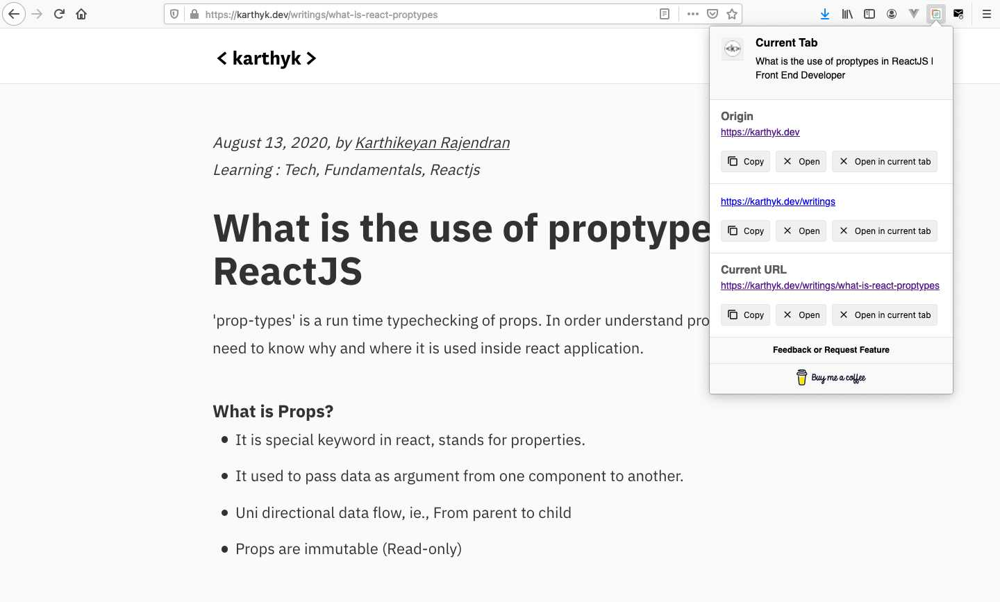

# Smart address bar
A simple web extension to split current tab url. user can copy to clip board or go to specific part of URL listed.

[Website](https://smartaddressbar.versoly.page/)




## Project setup

```
npm install
```

### Compiles and hot-reloads for development
```
npm run serve
```

### Customize configuration
See [Configuration Reference](https://cli.vuejs.org/config/).

### Using 
[Vue Cli Extension](https://vue-web-extension.netlify.app/intro/development-workflow.html)

[URL parser](https://dmitripavlutin.com/parse-url-javascript/)
